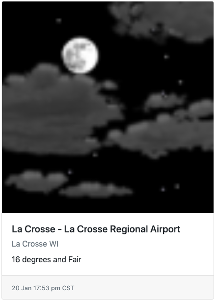

# Weathervane

Weathervane is a web app designed to provide an easy way to access basic weather information for latitude and longitude coordinates. The weather data is pulled from the National Weather Service API, so coordinates must fall within the United States in order to be valid input.

## Getting Started

The only step to get the application running is to open [weathervane.html](weathervane.html) in your web browser of choice.

## Usage

### Adding a Location

1. Input the latitude and longitude coordinates of your desired location at the top right of the page.
   - Coordinates should be in degrees north and degrees east form. For example, the coordinates for Seattle, WA are latitude 47.6062 and longitude -122.3321.
   - **Remember:** Coordinates must be within the United States.
2. Click the "Add" button.

### Understanding the Provided Weather Data

- On top of this forecast is a visual representation of the current weather. Not all forecasts from the National Weather Service come with images, so this may not be included in your forecast.
- Next, the name of the weather tower closest to the given coordinates is provided.
- Below the name is a short description of the area the weather tower is found in, usually the name of a city.
- Finally, the area's current weather is described.
- At the bottom of the forecast is the time at which the provided data was taken.

## Built With

- [jQuery](https://jquery.com)
- [Bootstrap](https://getbootstrap.com)
